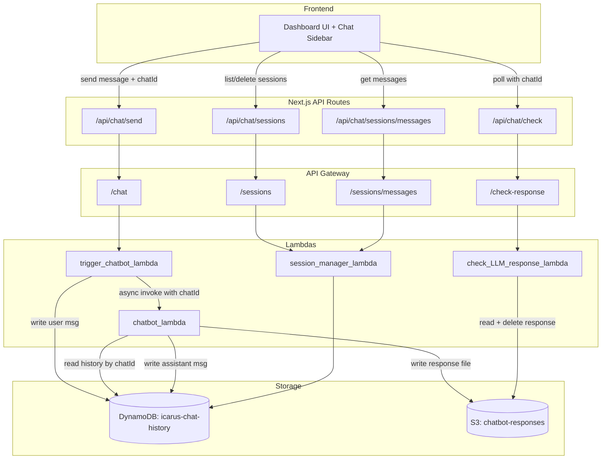

# Design Document: Chat Conversation History

## Overview

This feature adds persistent, multi-session conversation history to the Project Icarus campaign chatbot. Today the frontend holds messages in React state and passes the full `conversation_history` array on every request — a page reload wipes everything. The design introduces a DynamoDB table to store messages and session metadata, a new `session_manager_lambda` for CRUD operations, updated S3 response keying to support concurrent sessions, and a sidebar UI for session navigation.

The core change is moving the source of truth for conversation history from the browser to DynamoDB, keyed by `chatId` (UUID) per session. The async chat flow (trigger → chatbot → S3 → check) is preserved but extended to carry `chatId` through every hop.

## Architecture

### Current Flow

```
Dashboard UI → /api/chat/send → API GW /chat → trigger_chatbot_lambda
                                                      ↓ (async invoke)
                                                chatbot_lambda → S3 response
Dashboard UI ← /api/chat/check ← API GW /check-response ← check_LLM_response_lambda ← S3
```

Messages live only in React state. The full `conversation_history` array is sent with each request.

### Proposed Flow



### Key Architectural Decisions

1. **Single DynamoDB table** — Messages and session metadata share one table. Metadata uses a special `timestamp = "META"` sort key. This avoids a second table and keeps queries simple via the `userId-index` GSI.

2. **User message written by trigger_lambda, assistant message written by chatbot_lambda** — The trigger lambda has the user message immediately and can write it before the async invoke. The chatbot lambda writes the assistant message after Bedrock responds. This keeps writes close to where data originates.

3. **S3 response key changes from `{username}/{username}_response.md` to `{username}/{chatId}_response.md`** — Prevents concurrent sessions from overwriting each other's response files.

4. **Conversation history loaded from DynamoDB, not from request payload** — The chatbot lambda queries DynamoDB by `chatId` instead of trusting the `conversation_history` array from the frontend. This is more reliable and reduces payload size.

5. **New session_manager_lambda** — Dedicated lambda for session CRUD keeps concerns separated from the chat flow lambdas.

## Components and Interfaces

### 1. CDK Infrastructure (`infra-stack.ts`)

New resources to add:

- **DynamoDB Table**: `icarus-chat-history-{account_id}`
  - PK: `chatId` (String)
  - SK: `timestamp` (String)
  - GSI `userId-index`: PK `userId` (String), SK `createdAt` (String)
  - Billing: PAY_PER_REQUEST
  - Removal policy: DESTROY
- **session_manager_lambda**: Python 3.13, handler `session_manager_lambda.lambda_handler`
- **API Gateway resources**: `/sessions` (GET, DELETE), `/sessions/messages` (GET)
- **Environment variable** `CHAT_HISTORY_TABLE` passed to: trigger_chatbot_lambda, chatbot_lambda, check_LLM_response_lambda, session_manager_lambda
- **IAM**: Grant `lambda_role` read/write on the DynamoDB table

### 2. trigger_chatbot_lambda (modified)

**New input fields**: `chatId` (optional), `email`

**Behavior changes**:
- If `chatId` is absent, generate a UUID and create a META record in DynamoDB
- Write user message to DynamoDB (`chatId`, timestamp, userId, role="user", content)
- Pass `chatId` to chatbot_lambda in the async invoke payload
- Return `chatId` in the response body
- Stop passing `conversation_history` to chatbot_lambda (it will load from DDB)

**Interface**:
```python
# Request body
{
  "query": str,
  "email": str,
  "chatId": str | None  # new field
}

# Response body
{
  "status": "COMPLETED",
  "message": "Triggered successfully",
  "chatId": str  # new field — always returned
}
```

### 3. chatbot_lambda (modified)

**Behavior changes**:
- Receive `chatId` from trigger_lambda payload
- Query DynamoDB for conversation history by `chatId` (sorted by timestamp, excluding META)
- Use DynamoDB history for the Bedrock `messages` array instead of `conversation_history` from payload
- Write assistant response to DynamoDB after Bedrock call
- Write S3 response to `{username}/{chatId}_response.md` instead of `{username}/{username}_response.md`

### 4. check_LLM_response_lambda (modified)

**Behavior changes**:
- Accept `chatId` query parameter
- Look for S3 key `{username}/{chatId}_response.md` instead of `{username}/{username}_response.md`
- Delete the response file after reading (existing behavior, new key)

### 5. session_manager_lambda (new)

**Routes** (determined by HTTP method + query params):

| Operation | Method | Params | Description |
|-----------|--------|--------|-------------|
| List sessions | GET `/sessions` | `userId` | Query GSI for META records, return sorted by `createdAt` desc |
| Delete session | DELETE `/sessions` | `chatId`, `userId` | Delete all items with given `chatId` (batch) |
| Get messages | GET `/sessions/messages` | `chatId` | Query by `chatId`, exclude META, sort by timestamp asc |

**Interface**:
```python
# GET /sessions?userId=user@example.com
# Response:
[
  {"chatId": "uuid", "title": "First 50 chars...", "createdAt": "2025-01-01T00:00:00Z"},
  ...
]

# DELETE /sessions?chatId=uuid&userId=user@example.com
# Response:
{"status": "DELETED", "chatId": "uuid"}

# GET /sessions/messages?chatId=uuid
# Response:
[
  {"role": "user", "content": "Hello", "timestamp": "2025-01-01T00:00:01Z"},
  {"role": "assistant", "content": "Hi there", "timestamp": "2025-01-01T00:00:02Z"},
  ...
]
```

### 6. Next.js API Routes (new + modified)

| Route | Method | Purpose |
|-------|--------|---------|
| `/api/chat/sessions` | GET | Proxy to API GW `/sessions` with `email` → `userId` |
| `/api/chat/sessions` | DELETE | Proxy to API GW `/sessions` with `chatId` + `email` → `userId` |
| `/api/chat/sessions/messages` | GET | Proxy to API GW `/sessions/messages` with `chatId` |
| `/api/chat/send` (modified) | POST | Add optional `chatId` in body, return `chatId` from response |
| `/api/chat/check` (modified) | GET | Add `chatId` query param, forward to API GW |

### 7. Dashboard UI + Chat Sidebar (modified + new)

**New state**:
- `chatId: string | null` — active session ID
- `sessions: ChatSession[]` — list of user's sessions

**Chat Sidebar component**:
- Fetches sessions on mount via `/api/chat/sessions`
- Renders session list with title + relative timestamp
- Click session → load messages via `/api/chat/sessions/messages`, set active `chatId`
- Delete button → DELETE `/api/chat/sessions`, remove from list
- "New Chat" button → clear messages, reset `chatId` to null

**Modified send flow**:
- Include `chatId` in send request body
- Store returned `chatId` in state after first message
- Include `chatId` in poll requests to `/api/chat/check`

**Modified clear behavior**:
- Clear button resets displayed messages and `chatId` to null
- Does NOT delete the session from DynamoDB

## Data Models

### DynamoDB Table: `icarus-chat-history-{account_id}`

**Table Schema**:
- Partition Key: `chatId` (String, UUID)
- Sort Key: `timestamp` (String, ISO 8601 or "META")

**GSI `userId-index`**:
- Partition Key: `userId` (String, email)
- Sort Key: `createdAt` (String, ISO 8601)

**Record Types**:

#### Message Record
| Attribute | Type | Description |
|-----------|------|-------------|
| `chatId` | String | Session UUID (PK) |
| `timestamp` | String | ISO 8601 timestamp (SK) |
| `userId` | String | User email |
| `role` | String | "user" or "assistant" |
| `content` | String | Message text |

#### Metadata Record (Session Header)
| Attribute | Type | Description |
|-----------|------|-------------|
| `chatId` | String | Session UUID (PK) |
| `timestamp` | String | Literal "META" (SK) |
| `userId` | String | User email |
| `createdAt` | String | ISO 8601 creation timestamp |
| `title` | String | First 50 chars of first user message |

### Frontend Types

```typescript
interface ChatSession {
  chatId: string;
  title: string;
  createdAt: string;
}

interface ChatMessage {
  role: "user" | "assistant";
  content: string;
  timestamp: string;
}
```


## Correctness Properties

*A property is a characteristic or behavior that should hold true across all valid executions of a system — essentially, a formal statement about what the system should do. Properties serve as the bridge between human-readable specifications and machine-verifiable correctness guarantees.*

### Property 1: Trigger lambda persists user messages correctly

*For any* valid chat request (with or without a `chatId`), the trigger lambda SHALL write a DynamoDB record where `chatId` is a valid UUID (generated if absent), `userId` matches the email, `role` equals "user", `content` matches the query text, `timestamp` is a valid ISO 8601 string, and the response body contains the `chatId`.

**Validates: Requirements 2.1, 2.2**

### Property 2: Chatbot lambda persists assistant messages correctly

*For any* chatId, userId, and Bedrock response text, the chatbot lambda SHALL write a DynamoDB record where `chatId` matches the input, `userId` matches the email, `role` equals "assistant", `content` matches the Bedrock response text, and `timestamp` is a valid ISO 8601 string.

**Validates: Requirements 2.3**

### Property 3: Chatbot lambda loads history from DynamoDB in ascending order

*For any* set of message records stored in DynamoDB for a given `chatId`, the chatbot lambda SHALL construct the Bedrock `messages` array with entries sorted by `timestamp` ascending, excluding any record with `timestamp` equal to "META".

**Validates: Requirements 2.4**

### Property 4: Session metadata record has correct structure and truncated title

*For any* first user message, the trigger lambda SHALL create a META record where `timestamp` equals "META", `userId` matches the email, `createdAt` is a valid ISO 8601 string, and `title` equals the first `min(50, len(message))` characters of the user message.

**Validates: Requirements 3.1**

### Property 5: List sessions returns correct fields sorted by creation time descending

*For any* set of session metadata records for a given `userId`, the session manager lambda SHALL return an array where each item contains `chatId`, `title`, and `createdAt`, and the array is sorted by `createdAt` in descending order.

**Validates: Requirements 3.3, 4.2**

### Property 6: Delete session removes all records for the chatId

*For any* session with N messages plus one META record (N+1 total records), after a delete operation on that `chatId`, the DynamoDB table SHALL contain zero records with that `chatId`.

**Validates: Requirements 4.3**

### Property 7: Get messages returns correctly shaped records sorted ascending, excluding META

*For any* set of records for a given `chatId` (including a META record), the get-messages operation SHALL return only non-META records, each containing `role`, `content`, and `timestamp` fields, sorted by `timestamp` in ascending order.

**Validates: Requirements 5.1, 5.2**

### Property 8: S3 response key uses chatId for both write and read

*For any* username and chatId, the S3 key used by chatbot_lambda to write the response and by check_LLM_response_lambda to read the response SHALL both equal `{username}/{chatId}_response.md`.

**Validates: Requirements 10.1, 10.2**

## Error Handling

### Lambda Error Handling

| Scenario | Lambda | Behavior |
|----------|--------|----------|
| Missing `email` in request | trigger_chatbot_lambda | Return 400 with error message |
| DynamoDB write failure | trigger_chatbot_lambda, chatbot_lambda | Log error, return 500 |
| Invalid/missing `chatId` on delete | session_manager_lambda | Return 404 with "session not found" |
| Empty query results (no sessions) | session_manager_lambda | Return 200 with empty array |
| Empty query results (no messages) | session_manager_lambda | Return 200 with empty array |
| S3 response file not found | check_LLM_response_lambda | Return 200 with status "IN_PROGRESS" (existing behavior) |
| Bedrock call failure | chatbot_lambda | Log error, return 500 (existing behavior) |
| DynamoDB query failure on history load | chatbot_lambda | Log error, return 500 |

### Next.js API Route Error Handling

All API routes follow a consistent pattern:
- Catch any exception from the API Gateway call
- Return `{ status: "FAILED", message: <error message> }` with appropriate HTTP status code (500 for unexpected errors, pass-through for upstream status codes)

### Frontend Error Handling

| Scenario | Behavior |
|----------|----------|
| Session list fetch fails | Show error toast, keep sidebar empty |
| Message history fetch fails | Show error message in chat panel |
| Delete session fails | Show error toast, keep session in list |
| Send message fails (no chatId returned) | Show error in chat, don't update chatId state |
| Poll fails | Retry with existing logic, show error after max retries |

## Testing Strategy

### Unit Tests (Example-Based)

Focus on specific scenarios, edge cases, and wiring:

- **CDK assertions**: Verify DynamoDB table schema, GSI, billing mode, removal policy, environment variables, API Gateway resources, lambda configurations (Requirements 1.1–1.6, 4.1, 4.5, 5.3)
- **trigger_chatbot_lambda**: Test chatId pass-through in invoke payload (2.5), error responses for missing fields
- **session_manager_lambda**: Test 404 on delete of non-existent session (4.4), empty array for session with no messages (5.4), GSI query usage (3.2)
- **Next.js API routes**: Test parameter forwarding and error handling for all routes (6.1–6.4, 7.1–7.2, 10.3)
- **Dashboard UI components**: Test session selection, clear behavior, new chat button, chatId state management (7.3–7.4, 8.1–8.6, 9.1–9.3, 10.4)

### Property-Based Tests

Each property test uses `hypothesis` (Python) for lambda logic. Minimum 100 iterations per property.

| Property | Test Description | Library |
|----------|-----------------|---------|
| Property 1 | Generate random emails, queries, optional chatIds → verify DDB write structure and UUID generation | hypothesis |
| Property 2 | Generate random chatIds, emails, mock Bedrock responses → verify assistant DDB write | hypothesis |
| Property 3 | Generate random message sets in mock DDB → verify Bedrock messages array is sorted ascending, META excluded | hypothesis |
| Property 4 | Generate random first messages (varying length) → verify META record structure and title truncation | hypothesis |
| Property 5 | Generate random session metadata sets → verify list response is sorted descending with correct fields | hypothesis |
| Property 6 | Generate random sessions with varying message counts → verify all records deleted | hypothesis |
| Property 7 | Generate random message sets with META → verify META excluded, sorted ascending, correct fields | hypothesis |
| Property 8 | Generate random usernames and chatIds → verify S3 key format for both write and read | hypothesis |

Each property test will be tagged with:
```
# Feature: chat-conversation-history, Property {N}: {property_text}
```

### Integration Tests

- End-to-end flow: send message → poll for response → verify message persisted in DynamoDB
- Session lifecycle: create session → list sessions → load messages → delete session → verify cleanup
- Concurrent sessions: two sessions for same user don't interfere with each other's S3 response files
