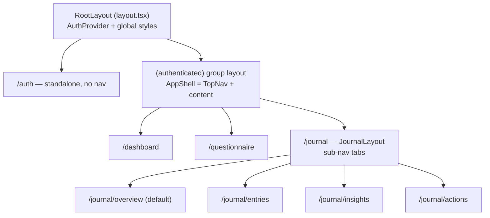
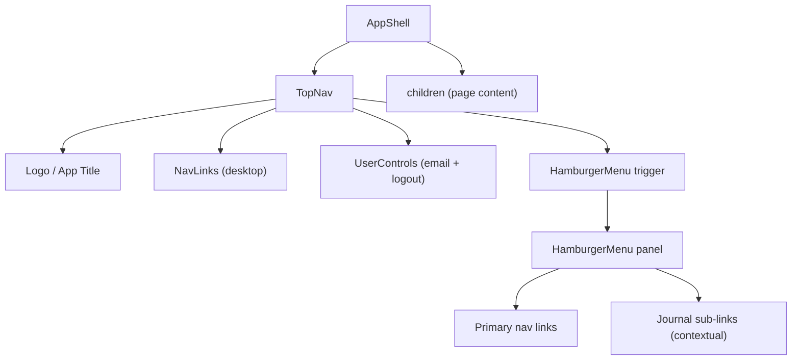

# Design Document: UI Rework — Modular Navigation

## Overview

This design transforms the icarus-ui frontend from a monolithic page-based architecture (where all UI logic lives in `page.tsx` files with no shared components) into a modular component system with a unified top navigation bar. The rework introduces three key structural changes:

1. An **App Shell** layout with a persistent top navigation bar for all authenticated pages
2. A **component registry** organized by domain (`layout/`, `journal/`, `shared/`) under `src/components/`
3. A new **Campaign Journal** module with four sub-pages (Overview, Entries, Insights, Actions)

Existing pages (Dashboard, Questionnaire) are migrated into the App Shell, and the Auth page continues to render standalone. The design uses Next.js 15 App Router conventions (nested layouts, route groups), Tailwind CSS v4 utility classes, and the existing CSS custom properties for theming.

## Architecture

### High-Level Architecture

The architecture follows a layered composition model using Next.js App Router's nested layout system:



### Route Group Strategy

Next.js App Router route groups (parenthesized folders) let us apply the App Shell layout to authenticated pages without affecting the URL structure:

- `src/app/(authenticated)/layout.tsx` — renders `AppShell` (TopNav + content area), guards with `useRequireAuth`
- `src/app/(authenticated)/dashboard/page.tsx` — migrated Dashboard
- `src/app/(authenticated)/questionnaire/page.tsx` — migrated Questionnaire
- `src/app/(authenticated)/journal/layout.tsx` — adds Journal sub-navigation tabs
- `src/app/(authenticated)/journal/page.tsx` — redirects to `/journal/overview`
- `src/app/(authenticated)/journal/overview/page.tsx`
- `src/app/(authenticated)/journal/entries/page.tsx`
- `src/app/(authenticated)/journal/insights/page.tsx`
- `src/app/(authenticated)/journal/actions/page.tsx`
- `src/app/auth/page.tsx` — remains outside the group, no TopNav

### Component Composition



## Components and Interfaces

### Directory Structure

```
src/
├── components/
│   ├── layout/
│   │   ├── AppShell.tsx
│   │   ├── TopNav.tsx
│   │   ├── HamburgerMenu.tsx
│   │   ├── NavLinks.tsx
│   │   ├── UserControls.tsx
│   │   └── index.ts
│   ├── journal/
│   │   ├── JournalSubNav.tsx
│   │   ├── OverviewPage.tsx
│   │   ├── PriorityCard.tsx
│   │   ├── ActivityItem.tsx
│   │   ├── InsightCard.tsx
│   │   ├── ActionItem.tsx
│   │   └── index.ts
│   └── shared/
│       ├── Button.tsx
│       ├── Card.tsx
│       ├── FilterChip.tsx
│       └── index.ts
├── app/
│   ├── layout.tsx              (root — AuthProvider, globals)
│   ├── page.tsx                (redirect logic)
│   ├── globals.css
│   ├── auth/
│   │   └── page.tsx            (standalone, no AppShell)
│   ├── (authenticated)/
│   │   ├── layout.tsx          (AppShell wrapper)
│   │   ├── dashboard/
│   │   │   └── page.tsx
│   │   ├── questionnaire/
│   │   │   └── page.tsx
│   │   └── journal/
│   │       ├── layout.tsx      (JournalSubNav)
│   │       ├── page.tsx        (redirect → overview)
│   │       ├── overview/
│   │       │   └── page.tsx
│   │       ├── entries/
│   │       │   └── page.tsx
│   │       ├── insights/
│   │       │   └── page.tsx
│   │       └── actions/
│   │           └── page.tsx
│   └── api/                    (unchanged)
└── lib/
    ├── auth-context.tsx        (unchanged)
    └── constants.ts            (unchanged)
```

### Component Interfaces

#### Layout Components

**AppShell** (`src/components/layout/AppShell.tsx`)
```typescript
// Wraps authenticated pages with TopNav + scrollable content area.
// Used in (authenticated)/layout.tsx.
interface AppShellProps {
  children: React.ReactNode;
}
```
- Renders `<TopNav />` fixed at top
- Renders `children` in a `<main>` with top padding to clear the fixed nav, max-width constraint, and horizontal centering

**TopNav** (`src/components/layout/TopNav.tsx`)
```typescript
interface TopNavProps {
  currentPath: string; // from usePathname()
}
```
- Fixed position, full-width, white background, bottom border
- Left: app logo/title ("🎭 Project Icarus")
- Center/right (≥768px): `<NavLinks />` for Dashboard, Questionnaire, Journal
- Far right: `<UserControls />`
- ≥768px: also shows hamburger trigger for Journal sub-nav when inside `/journal`
- <768px: hides NavLinks, shows only logo + hamburger trigger

**HamburgerMenu** (`src/components/layout/HamburgerMenu.tsx`)
```typescript
interface HamburgerMenuProps {
  isOpen: boolean;
  onClose: () => void;
  currentPath: string;
}
```
- Slide-in panel from the right (or dropdown) with semi-transparent backdrop
- Lists all primary nav links
- When `currentPath` starts with `/journal`, additionally shows Journal sub-links (Overview, Entries, Insights, Actions)
- Clicking a link navigates and calls `onClose()`
- Clicking backdrop or pressing Escape calls `onClose()`
- Trigger icon animates between ☰ and ✕

**NavLinks** (`src/components/layout/NavLinks.tsx`)
```typescript
interface NavLinksProps {
  currentPath: string;
  orientation: "horizontal" | "vertical";
  onNavigate?: () => void; // called after navigation (for closing menu)
}
```
- Renders links for Dashboard (`/dashboard`), Questionnaire (`/questionnaire`), Journal (`/journal`)
- Active link gets distinct styling (underline + bold or color highlight)

**UserControls** (`src/components/layout/UserControls.tsx`)
```typescript
// No props — reads auth context internally.
```
- Displays `auth.email`
- Logout button that calls `auth.logout()` and navigates to `/auth`

#### Journal Components

**JournalSubNav** (`src/components/journal/JournalSubNav.tsx`)
```typescript
interface JournalSubNavProps {
  currentPath: string;
}
```
- Horizontal tab bar below TopNav (inside journal layout)
- Tabs: Overview, Entries, Insights, Actions
- Active tab gets underline/highlight styling

**PriorityCard** (`src/components/journal/PriorityCard.tsx`)
```typescript
interface PriorityCardProps {
  label: string;   // e.g., "Priority"
  text: string;    // descriptive text
}
```

**ActivityItem** (`src/components/journal/ActivityItem.tsx`)
```typescript
interface ActivityItemProps {
  title: string;
  tags: { region?: string; topic?: string };
}
```

**InsightCard** (`src/components/journal/InsightCard.tsx`)
```typescript
interface InsightCardProps {
  text: string;
  onConfirm: () => void;
  onEdit: () => void;
}
```

**ActionItem** (`src/components/journal/ActionItem.tsx`)
```typescript
interface ActionItemProps {
  text: string;
  onDone: () => void;
}
```

#### Shared Primitives

**Button** (`src/components/shared/Button.tsx`)
```typescript
interface ButtonProps extends React.ButtonHTMLAttributes<HTMLButtonElement> {
  variant: "primary" | "secondary" | "danger";
  size?: "sm" | "md";
  children: React.ReactNode;
}
```
- `primary`: `bg-[var(--primary)]` text-white
- `secondary`: border + text color, transparent background
- `danger`: `bg-[var(--danger)]` text-white

**Card** (`src/components/shared/Card.tsx`)
```typescript
interface CardProps {
  children: React.ReactNode;
  header?: React.ReactNode;
  padding?: "sm" | "md" | "lg";
  className?: string;
}
```
- White background, rounded corners, border using `var(--border)`

**FilterChip** (`src/components/shared/FilterChip.tsx`)
```typescript
interface FilterChipProps {
  label: string;
  active: boolean;
  onClick: () => void;
}
```
- Pill-shaped button
- Active: filled background (`var(--primary)` + white text)
- Inactive: border + muted text

### Barrel Exports

Each domain directory has an `index.ts`:

```typescript
// src/components/layout/index.ts
export { AppShell } from "./AppShell";
export { TopNav } from "./TopNav";
export { HamburgerMenu } from "./HamburgerMenu";
export { NavLinks } from "./NavLinks";
export { UserControls } from "./UserControls";

// src/components/journal/index.ts
export { JournalSubNav } from "./JournalSubNav";
export { PriorityCard } from "./PriorityCard";
export { ActivityItem } from "./ActivityItem";
export { InsightCard } from "./InsightCard";
export { ActionItem } from "./ActionItem";

// src/components/shared/index.ts
export { Button } from "./Button";
export { Card } from "./Card";
export { FilterChip } from "./FilterChip";
```

## Data Models

### Navigation Configuration

Navigation links are defined as a static configuration array to keep the TopNav and HamburgerMenu data-driven:

```typescript
// src/lib/navigation.ts
export interface NavItem {
  label: string;
  href: string;
  /** Paths that should mark this item as active (prefix match) */
  activePaths: string[];
}

export const PRIMARY_NAV_ITEMS: NavItem[] = [
  { label: "Dashboard", href: "/dashboard", activePaths: ["/dashboard"] },
  { label: "Questionnaire", href: "/questionnaire", activePaths: ["/questionnaire"] },
  { label: "Journal", href: "/journal", activePaths: ["/journal"] },
];

export const JOURNAL_SUB_NAV_ITEMS: NavItem[] = [
  { label: "Overview", href: "/journal/overview", activePaths: ["/journal/overview", "/journal"] },
  { label: "Entries", href: "/journal/entries", activePaths: ["/journal/entries"] },
  { label: "Insights", href: "/journal/insights", activePaths: ["/journal/insights"] },
  { label: "Actions", href: "/journal/actions", activePaths: ["/journal/actions"] },
];

export function isActive(currentPath: string, activePaths: string[]): boolean {
  return activePaths.some((p) => currentPath === p || currentPath.startsWith(p + "/"));
}
```

### Journal Data Types

Journal pages will initially render static/placeholder content. The data types below define the shape for when backend integration is added:

```typescript
// src/lib/journal-types.ts
export interface Priority {
  id: string;
  label: string;
  text: string;
}

export interface ActivityEntry {
  id: string;
  title: string;
  region?: string;
  topic?: string;
  createdAt: string;
}

export interface Insight {
  id: string;
  text: string;
  confirmed: boolean;
}

export interface SuggestedAction {
  id: string;
  text: string;
  done: boolean;
}

export type FilterCategory = "Location" | "Topic" | "Event" | "Date";
```

### Auth State (Existing — Unchanged)

```typescript
// Already in src/lib/auth-context.tsx
interface AuthState {
  email: string | null;
  authenticated: boolean;
  questionnaireCompleted: boolean;
}
```


## Correctness Properties

*A property is a characteristic or behavior that should hold true across all valid executions of a system — essentially, a formal statement about what the system should do. Properties serve as the bridge between human-readable specifications and machine-verifiable correctness guarantees.*

This feature is primarily a UI component architecture rework. Most acceptance criteria are concrete rendering checks (EXAMPLE) or structural/organizational constraints (SMOKE/not testable). However, two areas involve pure logic functions where behavior varies meaningfully with input and property-based testing adds value:

1. The `isActive()` navigation utility — a pure function mapping `(currentPath, activePaths[])` to a boolean
2. The hamburger menu's contextual content logic — determining which links to show based on the current path

### Property 1: Navigation active state correctness

*For any* valid route path and *for any* NavItem from the primary or journal sub-navigation configuration, the `isActive(currentPath, item.activePaths)` function SHALL return `true` if and only if `currentPath` exactly matches one of the `activePaths` entries or starts with one of them followed by a `/`.

**Validates: Requirements 1.3, 5.4**

### Property 2: Hamburger menu contextual links

*For any* current path string, the hamburger menu SHALL include journal sub-navigation links if and only if the path starts with `/journal`. For paths not starting with `/journal`, only primary navigation links SHALL be present.

**Validates: Requirements 2.2, 5.2**

## Error Handling

### Authentication Guard

- The `(authenticated)/layout.tsx` uses `useRequireAuth()` which redirects unauthenticated users to `/auth`. If the auth state is loading (e.g., reading from localStorage on mount), the layout renders a loading spinner rather than flashing the TopNav.
- If `auth.email` is `null` inside `UserControls`, the component gracefully shows nothing for the email display rather than rendering "null".

### Navigation Edge Cases

- If `usePathname()` returns an unexpected path (e.g., a 404 route within the authenticated group), no nav link is marked active. The `isActive` function simply returns `false` for all items, which is the correct default.
- The hamburger menu's `onClose` handler is always called on navigation, even if the target route is the current route (idempotent close).

### Journal Data Loading

- Journal pages initially render with placeholder/static data. When backend integration is added, each page will handle loading states (spinner), error states (error message with retry), and empty states (empty state illustration with guidance text).
- The `OverviewPage` component handles the case where priorities, activities, insights, or actions arrays are empty by rendering a contextual empty state message per section rather than hiding the section entirely.

### Responsive Breakpoint

- The 768px breakpoint is handled via Tailwind's `md:` prefix. Components do not rely on JavaScript-based resize listeners — the responsive behavior is purely CSS-driven, avoiding hydration mismatches between server and client renders.

## Testing Strategy

### Approach

This feature is a UI component architecture rework. The testing strategy uses a dual approach:

1. **Example-based unit tests** (primary) — Most acceptance criteria are concrete rendering and interaction checks. These are tested with React Testing Library + Jest/Vitest, rendering components and asserting DOM output.
2. **Property-based tests** (targeted) — Two pure logic functions (`isActive` and the hamburger menu link-filtering logic) benefit from property-based testing with `fast-check`. These functions have meaningful input variation and are cheap to run 100+ times.

### Property-Based Tests

Library: `fast-check` (TypeScript PBT library)

Each property test runs a minimum of 100 iterations.

**Test 1: isActive function**
- Tag: `Feature: ui-rework-modular-navigation, Property 1: Navigation active state correctness`
- Generator: random path strings (valid route segments, edge cases like trailing slashes, empty strings)
- Assertion: `isActive(path, activePaths)` returns true iff path matches or is a sub-path of an activePaths entry

**Test 2: Hamburger menu contextual links**
- Tag: `Feature: ui-rework-modular-navigation, Property 2: Hamburger menu contextual links`
- Generator: random path strings (mix of `/journal/*` paths and non-journal paths)
- Assertion: journal sub-links are included in the output iff path starts with `/journal`

### Example-Based Unit Tests

Organized by component domain:

**Layout components:**
- AppShell renders TopNav and children
- TopNav displays logo, nav links (desktop), user controls
- TopNav hides nav links and shows hamburger at <768px
- HamburgerMenu opens/closes on trigger click, backdrop click, Escape key
- HamburgerMenu navigates and closes on link click
- NavLinks highlights the correct active link for each route
- UserControls displays email and logout button

**Journal components:**
- JournalSubNav renders four tabs with correct active state
- OverviewPage renders all four sections (Priorities, Recent Activity, New Insights, Suggested Actions)
- OverviewPage renders FilterChips for all four categories
- PriorityCard, ActivityItem, InsightCard, ActionItem render correct content and handle callbacks

**Shared primitives:**
- Button renders correct styles for each variant (primary, secondary, danger)
- Card renders with/without header, with different padding
- FilterChip renders active and inactive states with correct styling

**Integration/routing:**
- Auth page renders without TopNav
- Dashboard and Questionnaire pages render within AppShell with TopNav
- `/journal` redirects to `/journal/overview`
- Root page redirect logic works for all three auth states

### Test File Organization

```
src/
├── components/
│   ├── layout/__tests__/
│   │   ├── AppShell.test.tsx
│   │   ├── TopNav.test.tsx
│   │   ├── HamburgerMenu.test.tsx
│   │   └── NavLinks.test.tsx
│   ├── journal/__tests__/
│   │   ├── JournalSubNav.test.tsx
│   │   └── OverviewPage.test.tsx
│   └── shared/__tests__/
│       ├── Button.test.tsx
│       ├── Card.test.tsx
│       └── FilterChip.test.tsx
└── lib/__tests__/
    └── navigation.test.ts    (property-based tests for isActive)
```
