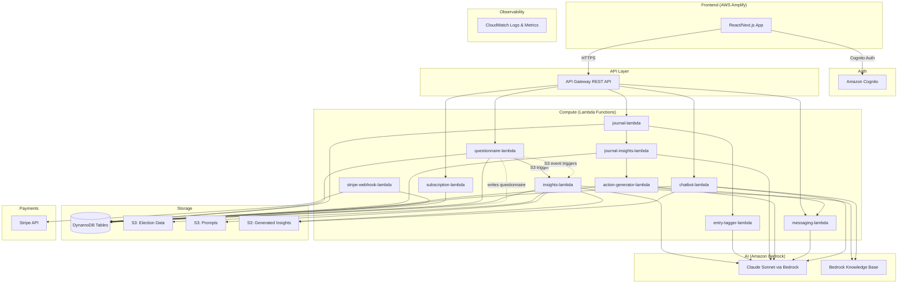
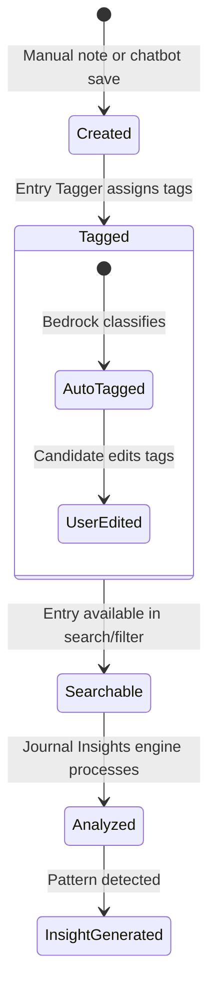
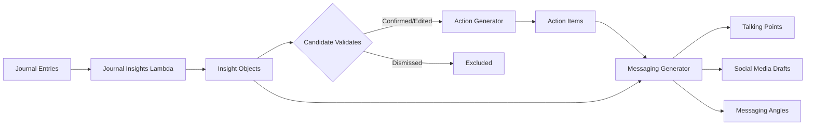
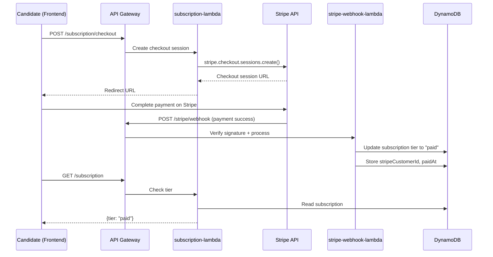

# Design Document: WinFlip Campaign Journal MVP

## Overview

WinFlip Phase 2 MVP evolves the Phase 1 "Project Icarus" proof-of-concept into a production-grade campaign intelligence platform for Virginia down-ballot candidates. The system replaces the Streamlit frontend with a React/Next.js application on AWS Amplify, introduces DynamoDB for structured data, adds a campaign journal with AI-driven insights/actions/messaging, archetype tone controls, Stripe payments, enhanced chatbot with threading, CI/CD pipelines, and CloudWatch-based observability.

### Key Architectural Changes from Phase 1

| Concern | Phase 1 (Icarus) | Phase 2 (WinFlip MVP) |
|---|---|---|
| Frontend | Streamlit (Python) | React/Next.js on AWS Amplify |
| Structured Data | S3 JSON files | DynamoDB tables |
| Unstructured Data | S3 | S3 (retained for election data, prompts, insights docs) |
| Chatbot Pattern | Async: trigger Lambda → poll S3 for response | Synchronous/streaming via Lambda response streaming or API Gateway timeout increase |
| Auth | Cognito (direct boto3 calls from Streamlit) | Cognito via Amplify Auth library |
| Payments | None | Stripe Checkout (sandbox) |
| AI Tone | Fixed | 5-level Archetype Tone scale |
| Journal | None | Full journal system with tagging, insights, actions, messaging |
| CI/CD | Manual `cdk deploy` | Automated pipelines (Amplify CI/CD + CDK Pipeline) |
| Logging | Basic `print()` statements | Structured CloudWatch logs + custom metrics |

### Design Decisions & Rationale

1. **DynamoDB single-table design per entity type** — Each major entity (questionnaires, journal entries, insights, actions, sessions, subscriptions) gets its own table with `candidateId` as partition key. This keeps queries simple and avoids complex GSI designs for an MVP while allowing per-entity scaling.

2. **Retain S3 for election data and generated insight documents** — Election data files are large JSON blobs best served from S3. Generated insight markdown documents are also large text artifacts. DynamoDB stores metadata/references; S3 stores the content.

3. **Synchronous chatbot responses** — Phase 1 used an async trigger→poll pattern (trigger_chatbot Lambda → chatbot_lambda writes to S3 → check_LLM_response polls S3). Phase 2 uses API Gateway with a 29-second timeout and Lambda response streaming to provide synchronous responses, eliminating the polling UX.

4. **Entry tagging via lightweight Bedrock call** — Each journal entry gets auto-tagged by a small Bedrock invocation that classifies location, topic, and event type. This runs inline during entry creation with a fallback to "unclassified" on failure.

5. **Stripe Checkout in sandbox mode** — MVP uses Stripe Checkout Sessions for upgrade flow. No subscription management (cancel/downgrade) in MVP — just free→paid upgrade.

6. **uv for all Python dependency management** — Consistent with Phase 1 practice, all Lambda packaging uses `uv` instead of pip.

---

## Architecture

### High-Level System Architecture



### Request Flow Patterns

**Questionnaire Save → Insights Generation:**
1. Frontend submits questionnaire → API Gateway → `questionnaire-lambda` → saves to DynamoDB + S3
2. S3 PUT event triggers `insights-lambda` → loads election data from S3 → calls Bedrock → saves insight doc to S3 + reference to DynamoDB

**Journal Entry Creation:**
1. Frontend submits note → API Gateway → `journal-lambda` → saves entry to DynamoDB
2. `journal-lambda` invokes `entry-tagger-lambda` (sync) → Bedrock classifies tags → updates entry in DynamoDB

**Chatbot Conversation:**
1. Frontend sends message → API Gateway → `chatbot-lambda` → loads context (questionnaire, insights, journal summaries from DynamoDB/S3) → calls Bedrock → returns response synchronously
2. On session save, `chatbot-lambda` creates a journal entry summary

**Insight → Action → Messaging Pipeline:**
1. `journal-insights-lambda` analyzes journal entries → generates Insight objects → saves to DynamoDB
2. On Insight confirmation, `action-generator-lambda` generates Actions → saves to DynamoDB
3. On messaging request, `messaging-lambda` generates content using Insight + Actions + Archetype Tone → returns to frontend

---

## Components and Interfaces

### Frontend Components (React/Next.js)

```
WinFlip Phase 2 - MVP/
├── frontend/                          # Next.js application
│   ├── package.json
│   ├── next.config.js
│   ├── amplify.yml                    # Amplify build config
│   ├── public/
│   │   └── assets/                    # WinFlip branding (logo, icons)
│   ├── src/
│   │   ├── app/                       # Next.js App Router
│   │   │   ├── layout.tsx             # Root layout with auth provider
│   │   │   ├── page.tsx               # Landing / redirect
│   │   │   ├── auth/
│   │   │   │   └── page.tsx           # Sign in / Sign up
│   │   │   ├── onboarding/
│   │   │   │   └── page.tsx           # Multi-step questionnaire
│   │   │   ├── dashboard/
│   │   │   │   └── page.tsx           # Main dashboard (insights + journal summary)
│   │   │   ├── journal/
│   │   │   │   └── page.tsx           # Journal entries, search, filters
│   │   │   ├── insights/
│   │   │   │   └── page.tsx           # AI insights review + validation
│   │   │   ├── chatbot/
│   │   │   │   └── page.tsx           # Threaded chatbot
│   │   │   ├── messaging/
│   │   │   │   └── page.tsx           # Generated messaging content
│   │   │   └── settings/
│   │   │       └── page.tsx           # Account, subscription, tone controls
│   │   ├── components/
│   │   │   ├── layout/
│   │   │   │   ├── Navbar.tsx
│   │   │   │   ├── Sidebar.tsx
│   │   │   │   └── Footer.tsx
│   │   │   ├── journal/
│   │   │   │   ├── JournalEntryForm.tsx
│   │   │   │   ├── JournalEntryCard.tsx
│   │   │   │   ├── JournalFilterBar.tsx
│   │   │   │   └── TagEditor.tsx
│   │   │   ├── insights/
│   │   │   │   ├── InsightCard.tsx
│   │   │   │   └── InsightValidation.tsx
│   │   │   ├── chatbot/
│   │   │   │   ├── ChatWindow.tsx
│   │   │   │   ├── ChatMessage.tsx
│   │   │   │   ├── ThreadList.tsx
│   │   │   │   └── ChatInput.tsx
│   │   │   ├── questionnaire/
│   │   │   │   ├── StepBasicInfo.tsx
│   │   │   │   ├── StepDemographics.tsx
│   │   │   │   ├── StepAddress.tsx
│   │   │   │   ├── StepRaceSelection.tsx
│   │   │   │   ├── StepBackground.tsx
│   │   │   │   └── StepArchetype.tsx
│   │   │   ├── messaging/
│   │   │   │   ├── TalkingPoints.tsx
│   │   │   │   ├── SocialMediaDraft.tsx
│   │   │   │   └── MessagingAngles.tsx
│   │   │   ├── tone/
│   │   │   │   └── ToneSlider.tsx
│   │   │   └── common/
│   │   │       ├── ErrorBanner.tsx
│   │   │       ├── LoadingSpinner.tsx
│   │   │       └── DailyPrompt.tsx
│   │   ├── lib/
│   │   │   ├── api.ts                 # API client (fetch wrapper)
│   │   │   ├── auth.ts                # Amplify Auth helpers
│   │   │   └── types.ts               # TypeScript interfaces
│   │   ├── hooks/
│   │   │   ├── useAuth.ts
│   │   │   ├── useJournal.ts
│   │   │   └── useChatbot.ts
│   │   └── styles/
│   │       └── globals.css            # WinFlip branding tokens
│   └── tsconfig.json
├── backend/                           # Lambda functions + CDK
│   ├── lambdas/
│   │   ├── questionnaire/
│   │   │   ├── handler.py
│   │   │   └── pyproject.toml
│   │   ├── insights/
│   │   │   ├── handler.py
│   │   │   ├── chunker.py             # Token-limit chunking logic
│   │   │   ├── pcm_chatbot.py         # Refactored from Phase 1 PCMChatbot class
│   │   │   └── pyproject.toml
│   │   ├── journal/
│   │   │   ├── handler.py             # CRUD for journal entries
│   │   │   └── pyproject.toml
│   │   ├── entry_tagger/
│   │   │   ├── handler.py
│   │   │   └── pyproject.toml
│   │   ├── journal_insights/
│   │   │   ├── handler.py
│   │   │   └── pyproject.toml
│   │   ├── action_generator/
│   │   │   ├── handler.py
│   │   │   └── pyproject.toml
│   │   ├── messaging/
│   │   │   ├── handler.py
│   │   │   └── pyproject.toml
│   │   ├── chatbot/
│   │   │   ├── handler.py
│   │   │   └── pyproject.toml
│   │   ├── stripe_webhook/
│   │   │   ├── handler.py
│   │   │   └── pyproject.toml
│   │   ├── subscription/
│   │   │   ├── handler.py
│   │   │   └── pyproject.toml
│   │   └── shared/
│   │       ├── models.py              # Pydantic data models
│   │       ├── dynamo.py              # DynamoDB helpers
│   │       ├── bedrock.py             # Bedrock client wrapper
│   │       ├── logger.py              # Structured logging
│   │       └── validators.py          # Request schema validation
│   ├── infra/
│   │   ├── bin/
│   │   │   └── app.ts
│   │   ├── lib/
│   │   │   ├── winflip-stack.ts       # Main CDK stack
│   │   │   ├── api-construct.ts       # API Gateway construct
│   │   │   ├── auth-construct.ts      # Cognito construct
│   │   │   ├── storage-construct.ts   # DynamoDB + S3 construct
│   │   │   └── lambda-construct.ts    # Lambda functions construct
│   │   ├── cdk.json
│   │   ├── package.json
│   │   └── tsconfig.json
│   ├── prompts/                       # Bedrock prompt templates
│   │   ├── campaign_insights_prompt.md
│   │   ├── campaign_advisor_prompt.md
│   │   ├── entry_tagger_prompt.md
│   │   ├── journal_insights_prompt.md
│   │   ├── action_generator_prompt.md
│   │   ├── messaging_generator_prompt.md
│   │   └── election_cycles.json
│   └── tests/
│       ├── unit/
│       │   ├── test_models.py
│       │   ├── test_journal.py
│       │   ├── test_tagger.py
│       │   ├── test_insights.py
│       │   └── test_chunker.py
│       └── property/
│           ├── test_serialization_properties.py
│           ├── test_journal_properties.py
│           └── conftest.py
└── README.md
```

### API Gateway Endpoints

| Method | Path | Lambda | Auth | Description |
|--------|------|--------|------|-------------|
| GET | `/questionnaire` | questionnaire-lambda | Cognito | Check if questionnaire exists |
| POST | `/questionnaire` | questionnaire-lambda | Cognito | Save/update questionnaire |
| GET | `/insights` | questionnaire-lambda | Cognito | Get generated insights reference |
| POST | `/journal/entries` | journal-lambda | Cognito | Create journal entry |
| GET | `/journal/entries` | journal-lambda | Cognito | List/search/filter entries |
| PUT | `/journal/entries/{entryId}` | journal-lambda | Cognito | Update entry (tags, text) |
| GET | `/journal/insights` | journal-insights-lambda | Cognito | Get journal-derived insights |
| POST | `/journal/insights/generate` | journal-insights-lambda | Cognito | Trigger insight generation |
| PUT | `/journal/insights/{insightId}` | journal-insights-lambda | Cognito | Validate insight (confirm/edit/dismiss) |
| GET | `/journal/actions` | action-generator-lambda | Cognito | Get actions |
| POST | `/journal/actions/generate` | action-generator-lambda | Cognito | Generate actions from insight |
| PUT | `/journal/actions/{actionId}` | action-generator-lambda | Cognito | Update action status |
| POST | `/messaging/generate` | messaging-lambda | Cognito | Generate messaging content |
| POST | `/chatbot/sessions` | chatbot-lambda | Cognito | Create new chat session |
| GET | `/chatbot/sessions` | chatbot-lambda | Cognito | List chat sessions |
| POST | `/chatbot/sessions/{sessionId}/messages` | chatbot-lambda | Cognito | Send message in session |
| GET | `/chatbot/sessions/{sessionId}` | chatbot-lambda | Cognito | Get session with messages |
| GET | `/chatbot/sessions/search` | chatbot-lambda | Cognito | Search across sessions |
| POST | `/chatbot/sessions/{sessionId}/save-to-journal` | chatbot-lambda | Cognito | Save session as journal entry |
| GET | `/subscription` | subscription-lambda | Cognito | Get current subscription |
| POST | `/subscription/checkout` | subscription-lambda | Cognito | Create Stripe checkout session |
| POST | `/stripe/webhook` | stripe-webhook-lambda | Stripe Sig | Handle Stripe webhooks |
| PUT | `/settings/tone` | questionnaire-lambda | Cognito | Update archetype tone |
| GET | `/settings/tone` | questionnaire-lambda | Cognito | Get current tone setting |

### Frontend State Management

The frontend uses React Context + `useReducer` for global state (auth, subscription tier, tone setting) and React Query (TanStack Query) for server state (journal entries, insights, chat sessions). This avoids heavy state management libraries while providing caching, optimistic updates, and background refetching.

```typescript
// Key contexts
AuthContext       → Cognito user session, tokens
SettingsContext   → Archetype tone, subscription tier
// React Query keys
['journal', 'entries', filters]
['journal', 'insights']
['journal', 'actions']
['chatbot', 'sessions']
['chatbot', 'sessions', sessionId]
['questionnaire']
['insights']  // campaign insights doc
```

---

## Data Models

### DynamoDB Tables

#### 1. `winflip-questionnaires`
| Attribute | Type | Key | Description |
|-----------|------|-----|-------------|
| candidateId | S | PK | Cognito user sub |
| email | S | | Candidate email |
| answers | M | | Questionnaire answers map |
| archetypeTone | S | | Current tone: "Cautious"\|"Calm"\|"Balanced"\|"Engaged"\|"Fired-up" |
| subscriptionTier | S | | "free"\|"paid" |
| stripeCustomerId | S | | Stripe customer ID (nullable) |
| createdAt | S | | ISO 8601 timestamp |
| updatedAt | S | | ISO 8601 timestamp |

#### 2. `winflip-journal-entries`
| Attribute | Type | Key | Description |
|-----------|------|-----|-------------|
| candidateId | S | PK | Cognito user sub |
| entryId | S | SK | ULID (sortable unique ID) |
| text | S | | Entry content |
| source | S | | "manual"\|"chatbot" |
| chatSessionId | S | | Reference to originating chat session (nullable) |
| locationTag | S | | AI-assigned or user-edited location tag |
| topicTag | S | | AI-assigned or user-edited topic tag |
| eventTypeTag | S | | AI-assigned or user-edited event type tag |
| createdAt | S | | ISO 8601 timestamp |
| updatedAt | S | | ISO 8601 timestamp |

**GSI: `topicTag-createdAt-index`** — PK: `topicTag`, SK: `createdAt` (for tag-based filtering)
**GSI: `candidateId-createdAt-index`** — PK: `candidateId`, SK: `createdAt` (for date-range queries)

#### 3. `winflip-insights`
| Attribute | Type | Key | Description |
|-----------|------|-----|-------------|
| candidateId | S | PK | Cognito user sub |
| insightId | S | SK | ULID |
| summary | S | | Human-readable insight text |
| sourceEntryIds | L | | List of journal entry IDs that sourced this insight |
| validationStatus | S | | "pending"\|"confirmed"\|"edited"\|"dismissed" |
| editedText | S | | Candidate's edited version (nullable) |
| createdAt | S | | ISO 8601 timestamp |
| updatedAt | S | | ISO 8601 timestamp |

#### 4. `winflip-actions`
| Attribute | Type | Key | Description |
|-----------|------|-----|-------------|
| candidateId | S | PK | Cognito user sub |
| actionId | S | SK | ULID |
| insightId | S | | Reference to source insight |
| description | S | | Action description |
| status | S | | "pending"\|"in_progress"\|"completed" |
| createdAt | S | | ISO 8601 timestamp |
| updatedAt | S | | ISO 8601 timestamp |

#### 5. `winflip-chat-sessions`
| Attribute | Type | Key | Description |
|-----------|------|-----|-------------|
| candidateId | S | PK | Cognito user sub |
| sessionId | S | SK | ULID |
| title | S | | Auto-generated or user-set session title |
| messages | L | | List of message objects `{role, content, timestamp}` |
| tags | L | | Auto-assigned topic tags for the session |
| createdAt | S | | ISO 8601 timestamp |
| updatedAt | S | | ISO 8601 timestamp |

#### 6. `winflip-subscriptions`
| Attribute | Type | Key | Description |
|-----------|------|-----|-------------|
| candidateId | S | PK | Cognito user sub |
| tier | S | | "free"\|"paid" |
| stripeCustomerId | S | | Stripe customer ID |
| stripeSessionId | S | | Last Stripe checkout session ID |
| paidAt | S | | ISO 8601 timestamp of payment (nullable) |
| createdAt | S | | ISO 8601 timestamp |
| updatedAt | S | | ISO 8601 timestamp |

### S3 Object Structures (Retained from Phase 1)

| Bucket | Key Pattern | Content |
|--------|-------------|---------|
| `winflip-election-data-{accountId}` | `{office}/{year}/{electionType}/{office}_{year}_{electionType}.json` | Historical election JSON |
| `winflip-prompts-{accountId}` | `{prompt_name}.md` | Bedrock prompt templates |
| `winflip-generated-insights-{accountId}` | `{candidateId}/{candidateId}_insights.md` | Generated insight markdown |
| `winflip-questionnaires-{accountId}` | `{candidateId}/{candidateId}_questionnaire.json` | Questionnaire JSON (kept for S3 trigger → insights) |

### Pydantic Data Models (Python)

```python
from pydantic import BaseModel, Field
from typing import Optional, List, Literal
from datetime import datetime
import ulid

class JournalEntry(BaseModel):
    candidateId: str
    entryId: str = Field(default_factory=lambda: str(ulid.new()))
    text: str
    source: Literal["manual", "chatbot"]
    chatSessionId: Optional[str] = None
    locationTag: str = "unclassified"
    topicTag: str = "unclassified"
    eventTypeTag: str = "unclassified"
    createdAt: str = Field(default_factory=lambda: datetime.utcnow().isoformat())
    updatedAt: str = Field(default_factory=lambda: datetime.utcnow().isoformat())

class Insight(BaseModel):
    candidateId: str
    insightId: str = Field(default_factory=lambda: str(ulid.new()))
    summary: str
    sourceEntryIds: List[str]
    validationStatus: Literal["pending", "confirmed", "edited", "dismissed"] = "pending"
    editedText: Optional[str] = None
    createdAt: str = Field(default_factory=lambda: datetime.utcnow().isoformat())
    updatedAt: str = Field(default_factory=lambda: datetime.utcnow().isoformat())

class Action(BaseModel):
    candidateId: str
    actionId: str = Field(default_factory=lambda: str(ulid.new()))
    insightId: str
    description: str
    status: Literal["pending", "in_progress", "completed"] = "pending"
    createdAt: str = Field(default_factory=lambda: datetime.utcnow().isoformat())
    updatedAt: str = Field(default_factory=lambda: datetime.utcnow().isoformat())

class ChatMessage(BaseModel):
    role: Literal["user", "assistant"]
    content: str
    timestamp: str = Field(default_factory=lambda: datetime.utcnow().isoformat())

class ChatSession(BaseModel):
    candidateId: str
    sessionId: str = Field(default_factory=lambda: str(ulid.new()))
    title: str = "New Conversation"
    messages: List[ChatMessage] = []
    tags: List[str] = []
    createdAt: str = Field(default_factory=lambda: datetime.utcnow().isoformat())
    updatedAt: str = Field(default_factory=lambda: datetime.utcnow().isoformat())

class QuestionnaireResponse(BaseModel):
    candidateId: str
    email: str
    answers: dict
    archetypeTone: Literal["Cautious", "Calm", "Balanced", "Engaged", "Fired-up"] = "Balanced"
    subscriptionTier: Literal["free", "paid"] = "free"
    stripeCustomerId: Optional[str] = None
    createdAt: str = Field(default_factory=lambda: datetime.utcnow().isoformat())
    updatedAt: str = Field(default_factory=lambda: datetime.utcnow().isoformat())
```


---

## AI/Bedrock Integration

### Model Selection

All AI operations use Amazon Bedrock with Claude Sonnet (`us.anthropic.claude-sonnet-4-5-20250929-v1:0`), consistent with Phase 1. The model is referenced via environment variable `MODEL_ID` to allow upgrades without code changes.

### Prompt Architecture

Each AI subsystem has a dedicated prompt template stored in S3 (`winflip-prompts-{accountId}`):

| Prompt File | Used By | Input Placeholders | Purpose |
|---|---|---|---|
| `campaign_insights_prompt.md` | insights-lambda | `{candidate_context}`, `{election_laws}`, `{election_cycles_context}`, `{context}` | Generate strategic insights from election data (retained from Phase 1) |
| `campaign_advisor_prompt.md` | chatbot-lambda | `{candidate_questionnaire}`, `{generated_insights}`, `{relevant_election_laws}`, `{user_query}` | Chatbot system prompt (retained from Phase 1, extended with journal context) |
| `entry_tagger_prompt.md` | entry-tagger-lambda | `{entry_text}` | Classify journal entry into location/topic/event tags |
| `journal_insights_prompt.md` | journal-insights-lambda | `{journal_entries}`, `{candidate_context}` | Analyze journal entries for patterns and insights |
| `action_generator_prompt.md` | action-generator-lambda | `{insight_text}`, `{candidate_context}` | Generate action items from confirmed insights |
| `messaging_generator_prompt.md` | messaging-lambda | `{insight_text}`, `{actions}`, `{archetype_tone}`, `{candidate_context}` | Generate talking points, social posts, messaging angles |

### Token Limit Handling (Insights Engine)

Phase 1 sends all election data in a single Bedrock call. For large districts with many precincts, this can exceed the model's context window.

Phase 2 strategy:
1. **Estimate token count** before calling Bedrock (rough heuristic: 1 token ≈ 4 characters)
2. **If within limit** (< 180K tokens for Claude Sonnet): single call (same as Phase 1)
3. **If exceeds limit**: split election data into chunks by election year/type, process each chunk with the same prompt template, then make a final summarization call that merges partial results into a unified insight document
4. The `chunker.py` module handles splitting and reassembly

```python
# Pseudocode for chunking strategy
def generate_insights_with_chunking(election_data, prompt_template, candidate_context):
    estimated_tokens = estimate_tokens(election_data + prompt_template + candidate_context)
    
    if estimated_tokens < TOKEN_LIMIT:
        return call_bedrock(prompt_template.format(context=election_data, ...))
    
    chunks = split_by_election_year(election_data, max_tokens=TOKEN_LIMIT * 0.7)
    partial_results = []
    for chunk in chunks:
        result = call_bedrock(prompt_template.format(context=chunk, ...))
        partial_results.append(result)
    
    return call_bedrock(SUMMARIZE_PROMPT.format(partial_insights=partial_results, ...))
```

### Entry Tagger Design

The entry tagger uses a lightweight Bedrock call with a structured output prompt:

```
Given the following campaign journal entry, classify it into:
- location_tag: The setting (e.g., "Town Hall", "Neighborhood Canvass", "Office", "Online", "unclassified")
- topic_tag: The subject (e.g., "education", "housing", "taxes", "affordability", "infrastructure", "unclassified")
- event_type_tag: The activity (e.g., "meeting", "fundraising", "canvassing", "town hall", "phone banking", "unclassified")

Entry: {entry_text}

Respond in JSON: {"location_tag": "...", "topic_tag": "...", "event_type_tag": "..."}
```

The tagger uses `temperature: 0.1` and `maxTokens: 100` for fast, deterministic classification. On Bedrock error, all tags default to `"unclassified"`.

### Chatbot Context Loading

Phase 2 chatbot loads richer context than Phase 1:

1. **Questionnaire** — from DynamoDB `winflip-questionnaires`
2. **Generated insights** — from S3 `winflip-generated-insights-{accountId}`
3. **Recent journal entries** — last 20 entries from DynamoDB `winflip-journal-entries`
4. **Archetype tone** — from DynamoDB `winflip-questionnaires.archetypeTone`
5. **Conversation history** — from the current `ChatSession.messages`

The system prompt is assembled by filling the `campaign_advisor_prompt.md` template with this context, plus an additional instruction block for tone:

```
TONE INSTRUCTION: Respond using a "{archetype_tone}" communication style.
- Cautious: Conservative, measured, risk-averse language
- Calm: Steady, reassuring, professional tone
- Balanced: Neutral, informative, moderate energy
- Engaged: Enthusiastic, action-oriented, motivating
- Fired-up: Bold, passionate, high-energy, urgent
```

---

## Campaign Journal System Design

### Journal Entry Lifecycle



### Insight → Action → Messaging Pipeline



### Daily Loop

On each login:
1. Check if candidate has created a journal entry today (query DynamoDB with `createdAt` >= start of today)
2. If no entry today → show `DailyPrompt` component encouraging journaling
3. If entries exist today → show summary of today's entries + any new pending insights

### Insight Generation Trigger

Journal insights are generated:
- On explicit request via `/journal/insights/generate` endpoint
- Automatically once per login session (frontend calls generate on dashboard load if not already generated today)
- Minimum 2 journal entries required; fewer entries → skip with informational message

---

## Archetype Tone Control System

### Tone Levels

| Level | Label | Description | Prompt Modifier |
|-------|-------|-------------|-----------------|
| 1 | Cautious | Conservative, measured, risk-averse | Use careful, hedging language. Emphasize risks and due diligence. |
| 2 | Calm | Steady, reassuring, professional | Use professional, reassuring language. Balanced risk/opportunity. |
| 3 | Balanced | Neutral, informative, moderate | Use clear, informative language. Equal weight to all perspectives. |
| 4 | Engaged | Enthusiastic, action-oriented | Use energetic, motivating language. Emphasize opportunities and action. |
| 5 | Fired-up | Bold, passionate, high-energy | Use bold, urgent language. Strong calls to action. Passionate advocacy. |

### Initial Tone Derivation

When a candidate completes the questionnaire, the system derives an initial tone recommendation from their communication style answers (Step 3 archetype questions). This is done by the `questionnaire-lambda` using a simple scoring heuristic based on answer patterns (e.g., "Rock/hip-hop banger" → +2 toward Fired-up, "Piano/classical piece" → +2 toward Cautious).

### Tone Application

The `archetypeTone` value is stored in `winflip-questionnaires` table and loaded by:
- `messaging-lambda` — adjusts vocabulary and intensity of generated content
- `chatbot-lambda` — adjusts advisory tone in system prompt
- `action-generator-lambda` — adjusts urgency framing of suggested actions

---

## Stripe Payment Integration

### Flow



### Webhook Security

- `stripe-webhook-lambda` verifies the `Stripe-Signature` header using the webhook signing secret
- Invalid signatures return HTTP 400 and log the attempt
- The webhook endpoint does NOT require Cognito auth (Stripe calls it directly)

### Sandbox Mode

MVP uses Stripe test mode. The checkout session is created with `mode: 'payment'` (one-time) rather than `mode: 'subscription'` to keep MVP simple. The `success_url` and `cancel_url` redirect back to the frontend settings page.

---

## Chatbot Enhancement

### Threading Model

Phase 1 had a single flat conversation per user. Phase 2 introduces threaded sessions:

- Each `ChatSession` is an independent conversation with its own message history
- Sessions are listed chronologically with title, date, and tags
- Candidates can create new sessions or continue existing ones
- Session search queries across all session message content using DynamoDB `contains` filter

### Response Pattern Change

Phase 1 pattern (removed):
1. Frontend → `trigger_chatbot` Lambda (async invoke of `chatbot_lambda`)
2. `chatbot_lambda` writes response to S3
3. Frontend polls `check_LLM_response` Lambda until S3 file appears

Phase 2 pattern:
1. Frontend → API Gateway → `chatbot-lambda` (synchronous)
2. `chatbot-lambda` loads context, calls Bedrock, returns response directly
3. API Gateway timeout set to 29 seconds (max)
4. Lambda timeout set to 60 seconds with 2048MB memory

This eliminates the S3 polling overhead and the `trigger_chatbot` + `check_LLM_response` Lambdas entirely.

### Auto-Journal from Chat

When a candidate explicitly saves a chat session to journal (via `/chatbot/sessions/{sessionId}/save-to-journal`):
1. `chatbot-lambda` generates a summary of the conversation using a lightweight Bedrock call
2. Creates a `JournalEntry` with `source: "chatbot"` and `chatSessionId` reference
3. Triggers entry tagging on the summary

---

## CI/CD Pipeline Design

### Frontend Pipeline (AWS Amplify)

Amplify provides built-in CI/CD:
1. **Source**: GitHub repository, `main` branch for prod, `dev` branch for dev
2. **Build**: `amplify.yml` defines build steps (`npm install`, `npm run build`, `npm run test`)
3. **Deploy**: Amplify auto-deploys on push to configured branches
4. **Environments**: `dev` branch → dev environment, `main` branch → prod (with manual approval)

```yaml
# amplify.yml
version: 1
frontend:
  phases:
    preBuild:
      commands:
        - npm ci
    build:
      commands:
        - npm run lint
        - npm run test -- --run
        - npm run build
  artifacts:
    baseDirectory: .next
    files:
      - '**/*'
  cache:
    paths:
      - node_modules/**/*
      - .next/cache/**/*
```

### Backend Pipeline (CDK + Lambda)

Backend uses GitHub Actions (or AWS CodePipeline):
1. **On push to `dev`**: lint → unit tests → property tests → `cdk synth` → `cdk deploy --context env=dev`
2. **On PR to `main`**: lint → unit tests → property tests → `cdk synth` → manual approval → `cdk deploy --context env=prod`
3. **Lambda packaging**: Each Lambda uses `uv` to install dependencies into a deployment package

```yaml
# .github/workflows/backend-deploy.yml (simplified)
name: Backend Deploy
on:
  push:
    branches: [dev]
    paths: ['backend/**']
jobs:
  deploy:
    runs-on: ubuntu-latest
    steps:
      - uses: actions/checkout@v4
      - uses: actions/setup-python@v5
        with:
          python-version: '3.13'
      - run: pip install uv
      - run: cd backend && uv sync
      - run: cd backend && uv run pytest tests/
      - uses: actions/setup-node@v4
        with:
          node-version: '20'
      - run: cd backend/infra && npm ci
      - run: cd backend/infra && npx cdk synth
      - run: cd backend/infra && npx cdk deploy --require-approval never --context env=dev
```

---

## Logging and Analytics Design

### Structured Logging

All Lambda functions use a shared `logger.py` module that outputs structured JSON to CloudWatch:

```python
import json, time, os

def log_event(operation: str, candidate_id: str, **kwargs):
    print(json.dumps({
        "timestamp": time.time(),
        "operation": operation,
        "candidateId": candidate_id,
        "functionName": os.environ.get("AWS_LAMBDA_FUNCTION_NAME"),
        **kwargs
    }))
```

### Bedrock Token Tracking

Each Bedrock call logs input/output token counts from the response metadata:

```python
response = bedrock_runtime.converse(...)
usage = response.get("usage", {})
log_event("bedrock_invocation",
    candidate_id=candidate_id,
    operation_type="insights_generation",  # or "entry_tagging", "chatbot", etc.
    input_tokens=usage.get("inputTokens", 0),
    output_tokens=usage.get("outputTokens", 0),
    model_id=MODEL_ID,
    estimated_cost=estimate_cost(usage)
)
```

### CloudWatch Custom Metrics

Published via `boto3.client('cloudwatch').put_metric_data()`:
- `WinFlip/APIRequests` — per endpoint
- `WinFlip/BedrockTokens` — per operation type (input + output)
- `WinFlip/ErrorRate` — per Lambda function
- `WinFlip/ResponseLatency` — per endpoint (p50, p90, p99)

### Internal Analytics Dashboard

A CloudWatch dashboard (accessible to WinFlip team via IAM) showing:
- Daily active users (unique `candidateId` values in API logs)
- Questionnaire completion rate
- Journal entries per user (average, distribution)
- Chatbot sessions per user
- Insights generated count
- Bedrock cost per candidate per operation

---

## Migration Strategy from Phase 1 to Phase 2

### Phase 1 → Phase 2 Migration Steps

1. **Rename S3 buckets** from `icarus-*` to `winflip-*` prefix in CDK stack
2. **Create DynamoDB tables** via CDK (new resources, no migration needed for empty MVP)
3. **Refactor Lambda functions**:
   - Extract `PCMChatbot` class from `generate_insights_lambda.py` into `backend/lambdas/insights/pcm_chatbot.py`
   - Extract `prepare_user_context()` into `backend/lambdas/shared/models.py`
   - Replace S3 reads/writes for structured data with DynamoDB operations
   - Keep S3 reads for election data and prompt templates
   - Remove `trigger_chatbot.py` and `check_LLM_response_lambda.py` (replaced by synchronous pattern)
4. **Port questionnaire** from Streamlit multi-step to React multi-step form, adding demographics and address steps
5. **Port chatbot** from Streamlit chat UI to React `ChatWindow` component with threading
6. **Add new Lambda functions** for journal, tagger, journal-insights, actions, messaging, Stripe
7. **Update CDK stack** from `IcarusDannerInfraStack` to modular constructs (`WinFlipStack` with sub-constructs)
8. **Deploy prompts** — copy existing prompts from `local-files/` to new S3 bucket, add new prompt templates
9. **Election data** — copy from `predictif-election-data` bucket to `winflip-election-data-{accountId}` (or update references)

### What's Preserved from Phase 1

- `PCMChatbot` class logic (election data loading, retrieval plan generation, S3 extraction)
- `election_cycles.json` structure and content
- `campaign_insights_prompt.md` and `campaign_advisor_prompt.md` templates
- Cognito User Pool configuration (sign-in with email)
- Bedrock Knowledge Base integration for election laws
- S3 event notification pattern (questionnaire save → insights generation)

### What's Replaced

| Phase 1 | Phase 2 |
|---------|---------|
| Streamlit frontend | React/Next.js on Amplify |
| S3 JSON for questionnaires | DynamoDB + S3 (dual write for trigger) |
| Async chatbot (trigger→poll→S3) | Synchronous chatbot response |
| Single flat conversation | Threaded chat sessions in DynamoDB |
| No journal | Full journal system |
| No payments | Stripe Checkout |
| Manual CDK deploy | CI/CD pipelines |
| `print()` logging | Structured CloudWatch logging + metrics |

